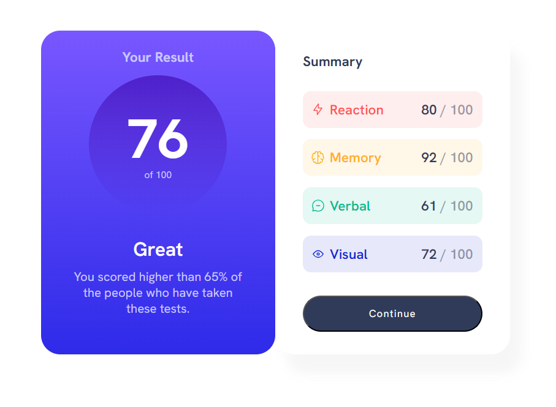
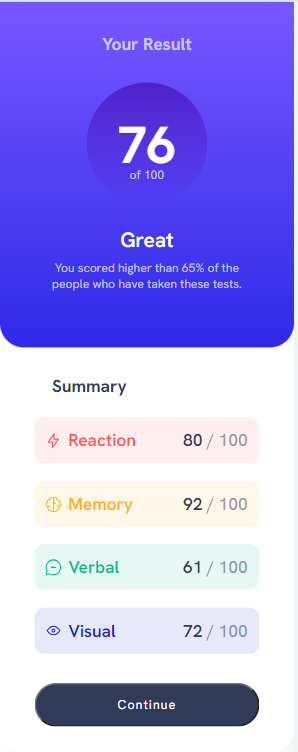

# Frontend Mentor - Results summary component solution

This is a solution to the [Results summary component challenge on Frontend Mentor](https://www.frontendmentor.io/challenges/results-summary-component-CE_K6s0maV). Frontend Mentor challenges help you improve your coding skills by building realistic projects. 

## Table of contents

- [Overview](#overview)
  - [The challenge](#the-challenge)
  - [Screenshot](#screenshot)
  - [Links](#links)
- [My process](#my-process)
  - [Built with](#built-with)
- [Author](#author)

## Overview
My challenge is to built a result-and-summary card component. A person's result is to be shown in the left card while the overall summary of the quiz is to be shown on the right side. In the design, we also have a button which is designed for its linked state as well as for its hover state.

### The challenge

  The main challenge is to:

- To build out the results summary component and get it looking as close to the design as possible.
- Set an optimal layout for the interface depending on user device's screen size.
- Set appropriate behaviour for hover and focus states for all interactive elements on the page
- To use the local JSON data to dynamically populate the content

### Screenshot

### Links
- Live Site URL: [live site URL](https://alaina056.github.io/FrontendMentorProjects/)

## My process

### Built with

- HTML5 markup
- CSS custom properties
- CSS Grid
- JavaScript

## Author

- Frontend Mentor - [@Alaina056](https://www.frontendmentor.io/profile/Alaina056)

